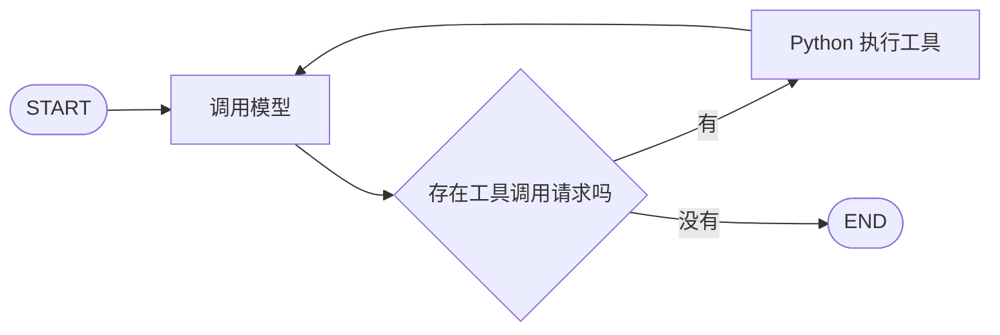

# LangGraph Workflows 与 Agents：代码实现学习笔记

> 整理日期：2026-09-17  
> 学习来源：[Workflows and agents 官方文档](https://docs.langchain.com/oss/python/langgraph/workflows-agents)  
> 本文结合当前仓库源码解释执行机制。代码片段有独立示例和伪代码，不应从头到尾拼接执行；涉及模型的示例需要先配置支持相应能力的 `llm`。模型输出是示意，不保证真实模型使用相同轨迹。

## 目录

1. [这篇文档在讲什么](#1-这篇文档在讲什么)
2. [一个图从创建到执行的完整过程](#2-一个图从创建到执行的完整过程)
3. [节点、边与条件边](#3-节点边与条件边)
4. [Agent 完整代码与逐轮执行](#4-agent-完整代码与逐轮执行)
5. [State 与 reducer：状态为什么不会丢](#5-state-与-reducer状态为什么不会丢)
6. [六种模式如何用代码理解](#6-六种模式如何用代码理解)
7. [Graph API 与 Functional API](#7-graph-api-与-functional-api)
8. [compile 与 invoke 的源码主线](#8-compile-与-invoke-的源码主线)
9. [如何观察执行过程](#9-如何观察执行过程)
10. [常见误区与复习卡片](#10-常见误区与复习卡片)
11. [自测题与参考答案](#11-自测题与参考答案)

## 1. 这篇文档在讲什么

核心问题是：**如何把模型调用、Python 函数和条件判断，组织成一个能够完成任务的程序？**

文档列出的是多种独立模式，不是要求把所有示例连接成一个大流程。

先分清三种职责：

| 组成部分 | 职责 | 例子 |
| --- | --- | --- |
| 模型 | 生成内容，或提出工具调用请求 | 返回文本、选择 `add` 工具及参数 |
| Python 函数 | 准备输入、执行工具、处理结果 | 查数据库、计算加法、整理报告 |
| LangGraph | 管理状态与执行顺序 | 安排下一个节点、合并更新、执行循环 |

工作流通常预先定义处理步骤。Agent 则让模型在给定工具与规则内，动态选择行动、参数和执行次数。

**有条件判断或循环，不一定就是 Agent。Agent 的图骨架也可以固定，动态的是运行时选择的行动。**

## 2. 一个图从创建到执行的完整过程

### 2.1 最小示例

下面假设 `llm` 已经初始化。

```python
from typing_extensions import TypedDict
from langgraph.graph import StateGraph, START, END


class State(TypedDict):
    question: str
    answer: str


def answer_question(state: State):
    response = llm.invoke(state["question"])
    return {"answer": response.content}


builder = StateGraph(State)
builder.add_node("answer_question", answer_question)
builder.add_edge(START, "answer_question")
builder.add_edge("answer_question", END)

graph = builder.compile()

result = graph.invoke({"question": "什么是 LangGraph？"})
print(result["answer"])
```

### 2.2 建图阶段：描述将来如何执行

```python
builder = StateGraph(State)
builder.add_node("answer_question", answer_question)
builder.add_edge(START, "answer_question")
builder.add_edge("answer_question", END)
graph = builder.compile()
```

此时注册状态结构、节点函数和执行关系，再构造可执行对象。

**`add_node` 和 `compile` 不会执行这里的业务节点，也不会调用模型。**

### 2.3 运行阶段：真正执行节点

从下面这行开始执行：

```python
result = graph.invoke({"question": "什么是 LangGraph？"})
```

状态变化如下：

```text
输入：{"question": "什么是 LangGraph？"}
    ↓
执行 answer_question(state)
    ↓
节点调用模型
    ↓
节点返回更新：{"answer": "LangGraph 是……"}
    ↓
LangGraph 合并状态：
{
    "question": "什么是 LangGraph？",
    "answer": "LangGraph 是……"
}
    ↓
到达 END，返回结果
```

节点返回的字典表示**本节点产生的状态更新**。

```python
return {"answer": response.content}
```

它不表示删除其他字段。原来的 `question` 仍然保留。

仅针对这个串行、普通字段的示例，可以用以下伪代码理解：

```python
state = {"question": "什么是 LangGraph？"}
update = answer_question(state)
state.update(update)
return state
```

实际框架并非简单执行 `dict.update`，还需要处理 reducer、并行任务、检查点和中断等机制。

### 2.4 TypedDict 不会自动创建字段值

```python
class State(TypedDict):
    question: str
    answer: str
```

这描述字段与类型，不会自动生成 `answer=""`。

例子只传入 `question`，`answer` 在节点运行后产生。因此，在读取可能尚不存在的字段时，应考虑使用 `state.get(...)` 或显式初始化。

## 3. 节点、边与条件边

| LangGraph 概念 | 含义 | 与普通 Python 的对应关系 |
| --- | --- | --- |
| 节点 | 一个工作步骤 | 可调用函数 |
| 普通边 | 指定后继步骤 | 顺序调用 |
| 条件边 | 根据返回值选择后继步骤 | `if / else` |
| 回到前面节点的边 | 重复执行 | 循环 |
| 多个任务被触发 | 执行多个工作项 | 并发任务 |
| State | 步骤之间传递的数据 | 显式上下文 |
| START / END | 入口与结束标记 | 流程边界 |

节点不一定调用模型，它可以只执行普通 Python 逻辑。

### 条件边怎么运行

```python
def choose_next(state):
    if state["score"] >= 80:
        return "finish"
    return "rewrite"


builder.add_conditional_edges(
    "evaluate",
    choose_next,
    {
        "finish": END,
        "rewrite": "write",
    },
)
```

顺序是：

1. 执行 `evaluate`。
2. 让它的更新对路由判断可见。
3. `choose_next` 读取更新后的状态。
4. 返回 `finish` 或 `rewrite`。
5. LangGraph 根据映射选择下一步。

`finish`、`rewrite` 是程序员定义的标签。条件边函数本身不会因为被注册为路由，就自动具备模型能力。

## 4. Agent 完整代码与逐轮执行

### 4.1 要完成的任务

用户输入：

> 先算 8 + 5，再把结果乘以 2。

Agent 的执行结构：



如果 Markdown 阅读器不支持 Mermaid，可以直接记住：

```text
START → 模型 → 有工具请求 → 执行工具 → 再次调用模型
             └→ 无工具请求 → END
```

### 4.2 定义工具

下面各段属于同一个 Agent 示例；运行前需自行初始化支持工具调用的 `llm`。

```python
from langchain_core.tools import tool


@tool
def add(a: int, b: int) -> int:
    """计算两个整数的和。"""
    return a + b


@tool
def multiply(a: int, b: int) -> int:
    """计算两个整数的积。"""
    return a * b


tools_by_name = {
    "add": add,
    "multiply": multiply,
}

model_with_tools = llm.bind_tools([add, multiply])
```

`bind_tools` 把工具名称、描述和参数结构提供给模型。**它没有在此处执行加法或乘法。**

### 4.3 定义模型节点和工具节点

```python
from langchain_core.messages import (
    HumanMessage,
    SystemMessage,
    ToolMessage,
)
from langgraph.graph import MessagesState, StateGraph, START, END


def call_model(state: MessagesState):
    response = model_with_tools.invoke(
        [
            SystemMessage(content="请使用提供的工具完成算术计算。"),
            *state["messages"],
        ]
    )
    return {"messages": [response]}


def execute_tools(state: MessagesState):
    response = state["messages"][-1]
    results = []

    for call in response.tool_calls:
        selected_tool = tools_by_name[call["name"]]

        # 到这里，Python 才真正执行工具函数。
        value = selected_tool.invoke(call["args"])

        results.append(
            ToolMessage(
                content=str(value),
                tool_call_id=call["id"],
            )
        )

    return {"messages": results}


def next_step(state: MessagesState):
    last_message = state["messages"][-1]
    return "tools" if last_message.tool_calls else "done"
```

这里的 `execute_tools` 用普通 `for` 循环逐个执行请求，用于展示机制。它没有实现并行执行或额外的工具异常处理。

### 4.4 连接并运行

```python
builder = StateGraph(MessagesState)
builder.add_node("model", call_model)
builder.add_node("tools", execute_tools)

builder.add_edge(START, "model")
builder.add_conditional_edges(
    "model",
    next_step,
    {"tools": "tools", "done": END},
)
builder.add_edge("tools", "model")

agent = builder.compile()

result = agent.invoke({
    "messages": [
        HumanMessage(content="先算 8 + 5，再把结果乘以 2")
    ]
})

print(result["messages"][-1].content)
```

### 4.5 第一次模型调用：提出加法请求

初始消息：

```text
HumanMessage：先算 8 + 5，再把结果乘以 2
```

假设模型返回的 `AIMessage` 包含以下工具请求：

```python
{
    "name": "add",
    "args": {"a": 8, "b": 5},
    "id": "call_1",
}
```

含义是：请程序执行 `add(a=8, b=5)`。

**这一刻模型只是提出请求，Python 加法函数还没有执行。**

条件边检测到工具请求，转向 `tools` 节点。

### 4.6 第一次工具执行：得到 13

```python
selected_tool = tools_by_name["add"]
value = selected_tool.invoke({"a": 8, "b": 5})
# value == 13
```

返回消息：

```python
ToolMessage(content="13", tool_call_id="call_1")
```

`tool_call_id` 表明这个结果对应哪个请求。

此时消息历史为：

```text
1. HumanMessage：先算 8 + 5，再把结果乘以 2
2. AIMessage：请求 add(8, 5)，请求 ID 是 call_1
3. ToolMessage：call_1 的结果是 13
```

`tools → model` 这条边让程序再次调用模型。

### 4.7 第二次模型调用：提出乘法请求

模型接收累计消息，知道加法结果是 13。假设返回：

```python
{
    "name": "multiply",
    "args": {"a": 13, "b": 2},
    "id": "call_2",
}
```

条件边再次转向工具节点。

### 4.8 第二次工具执行：得到 26

```python
value = tools_by_name["multiply"].invoke({"a": 13, "b": 2})
# value == 26
```

新增消息：

```text
4. AIMessage：请求 multiply(13, 2)，请求 ID 是 call_2
5. ToolMessage：call_2 的结果是 26
```

### 4.9 第三次模型调用：输出最终答案

假设模型返回普通回答：

```text
8 + 5 = 13，再乘以 2，结果是 26。
```

这次 `tool_calls` 为空，条件边返回 `done`，映射到 `END`。

完整消息历史：

| 顺序 | 消息类型 | 内容 |
| --- | --- | --- |
| 1 | HumanMessage | 用户问题 |
| 2 | AIMessage | 请求加法工具 |
| 3 | ToolMessage | 加法结果 13 |
| 4 | AIMessage | 请求乘法工具 |
| 5 | ToolMessage | 乘法结果 26 |
| 6 | AIMessage | 最终回答 |

按照这条示意轨迹，调用模型 3 次、执行工具 2 次。实际模型可能使用不同的请求安排。

**Agent 的核心循环：模型决策 → 程序执行 → 结果进入历史 → 模型再次决策。**

## 5. State 与 reducer：状态为什么不会丢

### 5.1 普通字段：更新对应字段

例如：

```python
return {"answer": "新的回答"}
```

通常会替换 `answer` 的旧值，并保留没有更新的其他字段。

### 5.2 MessagesState：按消息规则合并

仓库中的定义是：

```python
class MessagesState(TypedDict):
    messages: Annotated[list[AnyMessage], add_messages]
```

含义是：`messages` 是消息列表，使用 `add_messages` 合并更新。

所以：

```python
return {"messages": [response]}
```

通常会将新消息添加到已有历史。若消息 ID 与已有消息相同，`add_messages` 可以更新对应消息，因此不能把它完全等同于列表拼接。

源码：[MessagesState 与 add_messages](../libs/langgraph/langgraph/graph/message.py)。

### 5.3 模型为什么知道前面的计算结果

因为每次调用都把累计历史传给它：

```python
model_with_tools.invoke([
    SystemMessage(content="请使用工具计算。"),
    *state["messages"],
])
```

仅仅重复使用同一个 `llm` 对象，并不代表它自动保留了所有上下文。

需要区分：

- 一次图执行内部的历史：通过状态传递。
- 多次调用之间延续会话：需要主动传入历史，或配置 checkpointer 等机制。
- `compile()` 本身：不等于自动启用跨调用的持久化记忆。

### 5.4 多个任务更新同一个字段

例如多个写作任务都返回章节列表，需要指定合并规则：

```python
from typing import Annotated
from typing_extensions import TypedDict
import operator


class ReportState(TypedDict):
    sections_done: Annotated[list[str], operator.add]
```

更新过程可以理解为：

```text
旧值：[]
更新 A：["第一章"]
更新 B：["第二章"]
合并：["第一章", "第二章"]
```

`operator.add` 对列表执行拼接。这里的合并函数称为 **reducer**。

多个并行任务若写入同一个没有合并规则的普通字段，通常会触发并发更新冲突。

源码：

- [LastValue：普通字段更新与冲突检查](../libs/langgraph/langgraph/channels/last_value.py)
- [BinaryOperatorAggregate：按 reducer 合并](../libs/langgraph/langgraph/channels/binop.py)

## 6. 六种模式如何用代码理解

下表概括官方文档讨论的模式；本节的业务例子用于辅助理解。

| 模式 | 执行结构 | 关键问题 |
| --- | --- | --- |
| Prompt chaining | 一步的结果交给下一步 | 步骤之间有依赖吗？ |
| Parallelization | 多个独立任务并发，再汇总 | 哪些任务可以同时做？ |
| Routing | 分类后选择分支 | 输入应该交给谁处理？ |
| Orchestrator-worker | 先拆任务，再分派执行 | 运行时需要多少个子任务？ |
| Evaluator-optimizer | 生成、评价、带反馈重做 | 当前结果是否合格？ |
| Agent | 模型根据结果持续选择工具 | 下一步需要采取什么行动？ |

### 6.1 Prompt chaining：串行处理

伪代码：

```python
draft = write_article(topic)
checked = check_facts(draft)
final = polish(checked)
```

```text
写文章 → 核查 → 润色 → END
```

重点是后一步依赖前一步的结果。中间也可以增加检查，通过后提前结束，未通过则继续加工。

### 6.2 Parallelization：独立工作并发执行

```text
             ┌→ 检查错别字 ─┐
输入文章 ────┤              ├→ 汇总
             └→ 检查事实 ───┘
```

两个节点分别返回：

```python
{"typo_result": "..."}
{"fact_result": "..."}
```

因为写入不同字段，两个结果可以同时保留。

若要明确等待两个节点都完成，再执行汇总：

```python
builder.add_edge(["check_typos", "check_facts"], "summarize")
```

这里的列表形式表达显式汇合。不要把多条普通入边理解成所有复杂图形下都等价的等待机制。

### 6.3 Routing：先分类，再分流

伪代码：

```python
decision = classify(user_input)

if decision == "refund":
    handle_refund(user_input)
elif decision == "shipping":
    handle_shipping(user_input)
```

如果分类由模型完成，可以用结构化输出让程序读取结果：

```python
from typing import Literal
from pydantic import BaseModel


class Decision(BaseModel):
    category: Literal["refund", "shipping"]


classifier = llm.with_structured_output(Decision)
decision = classifier.invoke("我要查询物流")
print(decision.category)
```

需要区分两种能力：

- `with_structured_output`：让程序获得可按 schema 读取的结果。
- 条件边：根据结果安排后续节点。

结构化输出不保证分类的语义判断一定正确。

### 6.4 Orchestrator-worker：动态拆分和分派

例子：写一份调研报告。

```text
规划章节
    ↓
产生若干章节任务
    ↓
各自撰写章节
    ↓
收集并汇总
```

任务数量取决于运行时规划结果。动态派发的关键写法：

```python
from langgraph.types import Send


def assign_workers(state):
    return [
        Send("write_section", {"section": section})
        for section in state["sections"]
    ]
```

每个 `Send` 表示：安排目标节点执行一次，使用这份输入。

**同一个已注册节点可以产生多个执行任务；这不意味着临时生成新的 Python 函数。**

每个任务返回自己的结果，再通过 reducer 合并。若报告章节必须按规划顺序排列，可以在任务结果里保存章节序号，并在汇总时显式排序。

源码：[Send](../libs/langgraph/langgraph/types.py)。

### 6.5 Evaluator-optimizer：评价后返工

伪代码：

```python
feedback = None

while True:
    draft = generate(topic, feedback)
    evaluation = evaluate(draft)

    if evaluation.passed:
        return draft

    feedback = evaluation.feedback
```

流程：

```text
生成 → 评价 → 合格 → END
  ↑       ↓
  └── 不合格，带反馈重做
```

反馈必须被下一轮生成实际读取，例如加入 prompt。仅把它放在状态里，模型不会自动看到它。

实际业务应定义合理的停止条件，例如最多修改若干次。框架的执行步数限制也不等于业务上的质量判断。

### 6.6 Agent：动态选择下一次行动

Agent 的模型根据目标和历史结果，选择工具及参数，观察结果后继续决策。

对照前面的算术例子：

```text
读问题 → 请求加法 → 读结果 → 请求乘法 → 读结果 → 回答
```

程序仍决定可用工具、执行方式和结束规则。模型的自主性是在这些边界内发挥作用。

## 7. Graph API 与 Functional API

这两种 API 是流程的不同表达方式，不需要同时使用。

| Graph API | Functional API |
| --- | --- |
| 显式定义节点、边和状态 | 在函数中写控制流程 |
| 使用 `StateGraph` | 使用 `@entrypoint`、`@task` |
| 通过边描述执行依赖 | 通过任务调用和 Python 控制流表达依赖 |

Functional API 的简单示意：

```python
from langgraph.func import entrypoint, task


@task
def double(value: int) -> int:
    return value * 2


@entrypoint()
def workflow(value: int) -> int:
    result = double(value).result()
    return result + 1


print(workflow.invoke(3))  # 7
```

`@task` 调用返回 future，`.result()` 获取任务结果。

并发时，通常先提交多个任务，再等待它们：

```python
# 放在 entrypoint 中理解这段示意。
first = double(3)
second = double(5)
results = [first.result(), second.result()]
```

如果每提交一个任务就立即 `.result()` 等待，再提交下一个，通常就失去了这些独立任务并发的机会。

源码：[Functional API](../libs/langgraph/langgraph/func/__init__.py)。

## 8. compile 与 invoke 的源码主线

```text
StateGraph
    保存状态定义、节点、边
        ↓ compile()
CompiledStateGraph
    构造可执行节点、状态通道、触发关系
        ↓ invoke(input)
Pregel 执行循环
        ↓
确定本轮任务
        ↓
运行任务并收集状态更新
        ↓
合并更新，推进下一轮
        ↓
直到没有待执行任务等结束条件
```

### 8.1 compile：把流程描述转成可执行对象

在 [state.py](../libs/langgraph/langgraph/graph/state.py) 中搜索：

```text
class StateGraph
def compile
class CompiledStateGraph
def attach_node
def attach_edge
```

`compile` 构造 `CompiledStateGraph`，再附加节点、边和分支等执行配置。

它不是在“编译模型”，也不是直接开始执行用户任务。

### 8.2 状态字段对应不同通道

在同一文件中搜索 `_get_channel`。

普通字段默认使用 `LastValue`；带 reducer 的字段使用对应聚合通道。

在 [binop.py](../libs/langgraph/langgraph/channels/binop.py) 中可以看到聚合的核心语句：

```python
self.value = self.operator(self.value, value)
```

这就是 reducer 将已有值和新更新合并的位置。

### 8.3 invoke：通过执行循环获得结果

在 [pregel/main.py](../libs/langgraph/langgraph/pregel/main.py) 中搜索：

```text
def invoke
def stream
while loop.tick()
runner.tick
```

`invoke` 消费执行过程中产生的结果；底层执行循环安排任务，并由 runner 驱动执行。

**同一轮中的并行节点读取本轮状态，更新在轮次之间合并，再供后续轮次读取。**

因此，不要把 State 理解成多个并行函数随时修改、彼此立即可见的全局可变字典。

### 8.4 预置 Agent 也使用类似循环

在 [chat_agent_executor.py](../libs/prebuilt/langgraph/prebuilt/chat_agent_executor.py) 中搜索：

```text
def should_continue
last_message.tool_calls
workflow.add_edge("tools", entrypoint)
```

可以看到核心结构：检查工具请求、执行工具、回到模型节点。实际预置实现还有钩子、直接返回、结构化输出等分支。

工具执行实现可继续看 [tool_node.py](../libs/prebuilt/langgraph/prebuilt/tool_node.py)。

这些链接指向当前本地仓库，在线文档与本地源码版本可能不同，学习时优先跟踪实际函数和调用关系。

## 9. 如何观察执行过程

学习时不要只看最终答案，同时观察每个节点返回什么。

把前面 Agent 的 `invoke` 调用替换为：

```python
for update in agent.stream(
    {
        "messages": [
            HumanMessage(content="先算 8 + 5，再把结果乘以 2")
        ]
    },
    stream_mode="updates",
):
    print(update)
```

关注两件事：

1. 当前是哪个节点产生了输出？
2. 这个节点更新了哪些状态字段？

对于示意轨迹，节点顺序应类似：

```text
model → tools → model → tools → model
```

需要观察累计状态时，可以选择 `stream_mode="values"`。`updates` 适合看本次修改，`values` 适合看状态快照。

重新调用 `stream` 通常会重新执行图，不是读取前一次 `invoke` 的录像。

## 10. 常见误区与复习卡片

| 容易误解的地方 | 正确理解 |
| --- | --- |
| `compile()` 会开始调用模型 | 它构造可执行图，运行从 `invoke` / `stream` 等入口开始 |
| 节点返回值就是整个新状态 | 通常是部分状态更新，由字段规则合并 |
| 所有字段都是覆盖 | 普通字段通常覆盖，reducer 字段按规则合并 |
| `messages: list` 自动追加 | 追加与更新来自 `add_messages` 等 reducer |
| `bind_tools` 已经执行工具 | 它提供工具信息，程序执行工具请求 |
| 模型自己运行 Python 函数 | 模型产出名称和参数，宿主程序真正执行 |
| 复用同一个模型对象就有记忆 | 需要显式传入上下文，或使用相应会话机制 |
| 每个节点都必须是模型 | 普通计算、查询和格式化函数也可以是节点 |
| 条件边一定要调用模型 | 条件边通常是普通路由函数 |
| Agent 必须动态修改图结构 | 固定图中的行动选择也可以是动态的 |
| 多个任务写同一字段总能自动合并 | 需要合适的 reducer，否则可能冲突 |
| `Send` 会创建新函数 | 它为已有目标节点安排使用指定输入的任务 |

### 一分钟复习

- **State**：执行上下文。
- **Node**：读取输入、完成工作、返回更新。
- **Edge**：决定后继任务。
- **Reducer**：决定字段的新旧值如何合并。
- **compile**：构造可执行图。
- **invoke**：执行并返回结果。
- **stream**：执行并逐步暴露输出。
- **Tool call**：模型提出的工具执行请求。
- **ToolMessage**：宿主程序回传的工具结果。
- **Agent**：决策、行动、观察结果、再次决策的循环。

## 11. 自测题与参考答案

### 自测题

1. `add_node("model", call_model)` 执行完之后，模型被调用了吗？
2. 初始状态只有 `question`，节点返回 `{"answer": "A"}`，原问题还在吗？
3. 模型返回 `tool_calls` 时，Python 工具函数一定已经执行了吗？
4. 工具算出 13 后，为什么还要再次调用模型？
5. `ToolMessage.tool_call_id` 有什么作用？
6. 为什么每个模型节点只返回一条新消息，完整历史却不会丢？
7. 两个并行节点都写入一个普通列表字段，可以自动拼接吗？
8. `Send("worker", input)` 和 `add_node("worker", function)` 有什么区别？
9. 有循环的工作流为什么不一定是 Agent？
10. 想看到每个节点修改了什么，应该如何运行图？

### 参考答案

1. 没有，只是注册节点；执行图时才会调用业务函数。
2. 还在，返回值是字段更新，没有修改的字段会保留。
3. 没有。它是执行请求，需要程序根据名称和参数调用工具。
4. 模型需要根据工具结果决定继续行动还是输出答案。
5. 将工具结果对应到具体的工具调用请求。
6. `MessagesState` 使用 `add_messages` 合并新旧消息，而每次模型调用读取累计历史。
7. 不能假定会拼接；同一轮多次更新普通字段通常会冲突，需要定义 reducer。
8. `add_node` 注册可执行步骤，`Send` 为已有节点派发一次带输入的执行任务。
9. 循环可以只是固定的生成与评价过程；Agent 更强调模型动态选择行动。
10. 使用 `stream(..., stream_mode="updates")` 查看节点更新；看累计状态可用 `values`。

### 建议练习

1. 把模型换成返回固定字典的普通函数，先验证 State 如何变化。
2. 给一个节点添加条件边，观察输入变化如何影响后续路径。
3. 运行算术 Agent，逐条区分 HumanMessage、AIMessage 和 ToolMessage。
4. 用两个并行节点更新不同字段，再观察汇总节点的输入。
5. 为两个任务共同写入的列表添加 `operator.add`，理解 reducer 的作用。

做练习时始终记录：**当前状态是什么、哪个节点刚执行、下一步为什么执行它。**
