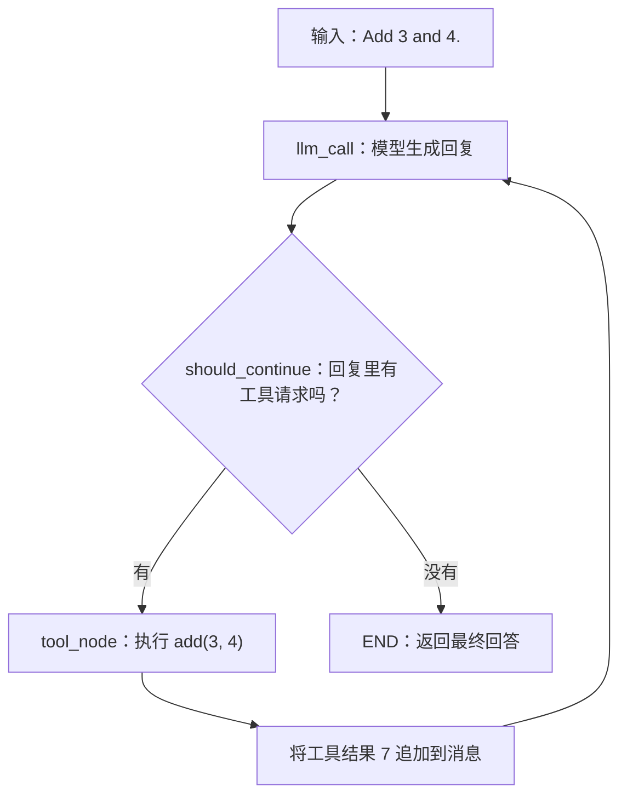

# learn 目录代码与 Agent 六个学习阶段

本文说明 `learn` 目录下各个示例的作用，以及它们对应的 Agent 学习阶段。

当前代码主要覆盖第 1、2 阶段，并实现了第 3 阶段中的基础 Agent 模式；第 4～6 阶段尚未涉及。

它实现的是一个会调用加法、乘法、除法工具的算术 Agent。功能虽然简单，但模型决策、工具执行、状态累积、条件路由这几个核心环节已经齐全。

## 1. 对应哪些学习阶段

| 学习阶段 | 当前覆盖情况 | 代码体现 |
|---|---|---|
| 1. 模型与工具循环 | 已覆盖 | 模型请求工具 → 执行工具 → 结果返回模型 |
| 2. State、Node、Edge、Reducer | 已覆盖 | 自定义状态、两个节点、条件边、消息追加 |
| 3. Workflow 与 Agent 模式 | 部分覆盖 | 实现了工具型 Agent；没有分别演示其他工作流模式 |
| 4. Persistence 与 Memory | 尚未覆盖持久化记忆 | 仅累积本次运行的消息，没有配置 checkpointer、store |
| 5. Interrupts 与 Streaming | 尚未覆盖 | 使用 `invoke()`，没有人工中断或流式输出 |
| 6. Subgraphs 与 Time travel | 尚未覆盖 | 只有一个图，没有子图和历史检查点操作 |

注意：[demo-code.py](./demo-code.py) 中也写了 `Step 1`～`Step 6`，那是“构建这个 Agent 的六个编码步骤”，与上面的六个学习阶段不是同一套编号。

## 2. HelloWorld：从最小的图开始

[HelloWorld.py](./HelloWorld.py) 对应第 2 个学习阶段，执行关系是：

```text
START → mock_llm → END
```

其中 `mock_llm()` 直接返回固定的 `"hello world"`，没有调用真实模型。

这个文件用于熟悉以下操作：

| 操作 | 作用 |
|---|---|
| `StateGraph(...)` | 创建图 |
| `add_node(...)` | 注册处理步骤 |
| `add_edge(...)` | 连接执行路径 |
| `compile()` | 构建可执行的图 |
| `invoke(...)` | 传入数据，执行图 |

## 3. 算术 Agent 的文件分工

| 文件 | 职责 | 重点理解 |
|---|---|---|
| [tool_self_defined.py](./tool_self_defined.py) | 定义三个算术工具 | Agent 能做哪些动作 |
| [state_self_defined.py](./state_self_defined.py) | 定义消息和调用次数 | 执行过程记录什么 |
| [model_node_self_defined.py](./model_node_self_defined.py) | 调用模型 | 模型怎样读取已有信息并输出下一步 |
| [tool_node.py](./tool_node.py) | 执行模型请求的工具 | 工具请求怎样变成真实计算 |
| [end_logic.py](./end_logic.py) | 判断继续还是结束 | 图怎样选择下一条路径 |
| [build_and_compile_agent.py](./build_and_compile_agent.py) | 初始化模型、绑定工具、组装图 | 所有部件怎样连接起来 |

以默认问题 `Add 3 and 4.` 为例，一次使用工具的执行过程如下：



如果 Markdown 阅读器不支持 Mermaid，可以按下面的文字流程理解：

```text
用户输入 → 模型节点 → 检查是否有工具请求
                         ├─ 有：工具节点 → 结果写入状态 → 再次进入模型节点
                         └─ 无：结束，返回结果
```

## 4. 定义工具、绑定工具、执行工具

这三个动作分别承担不同职责。

### 定义工具

在 `tool_self_defined.py` 中：

```python
@tool
def add(a: int, b: int) -> int:
    return a + b
```

上面是突出结构的简化片段，原文件还包含工具的 docstring。实际代码定义了 `add`、`multiply`、`divide` 三个工具，并创建了工具列表和名称索引。

### 绑定工具

在 `build_and_compile_agent.py` 中：

```python
model_with_tools = model.bind_tools(tools)
```

这一步让模型知道有哪些工具可选。绑定工具本身不会执行加法或乘法。

### 执行工具

在 `tool_node.py` 中：

```python
tool = tools_by_name[tool_call["name"]]
observation = tool.invoke(tool_call["args"])
```

模型可能生成这样的请求：

```text
工具名：add
参数：{"a": 3, "b": 4}
```

工具节点根据名称找到对应工具，再用这些参数计算结果。

核心区别是：**模型选择动作，程序执行动作。**

这里的 `tool_node` 是自己编写的函数，没有使用 LangGraph 预置的 `ToolNode` 类。

## 5. State：让模型知道刚才发生了什么

`state_self_defined.py` 中的状态只有两个字段：

```python
class MessagesState(TypedDict):
    messages: Annotated[list[AnyMessage], operator.add]
    llm_calls: NotRequired[int]
```

- `messages`：保存本次运行中的消息。
- `llm_calls`：记录调用了几次模型，初始输入可以不提供这个字段。

`operator.add` 是消息字段的 reducer，作用是将新列表追加到旧列表后面。

例如，一次典型的工具调用中，消息会逐步累积为：

```text
1. HumanMessage：计算 3 + 4
2. AIMessage：请求调用 add(a=3, b=4)
3. ToolMessage：工具执行结果为 7
4. AIMessage：最终回答 7
```

工具执行完后，模型节点会把累积的消息再次交给模型，因此模型能看到工具结果。

模型节点同时更新调用次数：

```python
"llm_calls": state.get("llm_calls", 0) + 1
```

这个字段没有设置追加规则，节点返回的数值会替换旧值。上述一次工具调用的典型路径中，模型调用两次：第一次提出工具请求，第二次根据结果回答。

注意：这里的 `MessagesState` 是自己定义的类；`HelloWorld.py` 使用的是 LangGraph 内置的同名类，阅读时需要区分。

## 6. 条件边：决定继续还是结束

`end_logic.py` 中的核心逻辑是：

```python
if last_message.tool_calls:
    return "tool_node"

return END
```

意思是：模型提出工具请求，就去执行；模型没有提出工具请求，就结束本次运行。

入口文件将这个判断接入图中：

```python
agent_builder.add_conditional_edges(
    "llm_call", should_continue, ["tool_node", END]
)
```

工具执行后，再返回模型节点：

```python
agent_builder.add_edge("tool_node", "llm_call")
```

这段循环就是这个 Agent 的核心。图的结构由代码固定，但每一轮用哪个工具、传什么参数、是否继续请求工具，由模型输出决定。

目前 `llm_calls` 只用于计数，代码没有用它设置停止条件。

## 7. 为什么还没有进入持久化记忆阶段

当前编译代码是：

```python
return agent_builder.compile()
```

这里没有配置 checkpointer，运行入口也没有传入 `thread_id`。

所以当前实现的是一次运行内部保存上下文。如果另发起一次调用，只传入一个新问题，这段代码不会自动接上上一次对话。

例如：

```text
第一次：计算 3 + 4。
第二次：把刚才的结果乘以 2。
```

要理解第二次的“刚才”，需要主动传回之前的消息，或者进一步加入按线程保存状态的机制。后者才是第 4 个学习阶段要学习的内容。

可以用下面的区别判断学习进度：

| 能力 | 当前是否实现 |
|---|---|
| 一次运行中，模型能读到前面的工具结果 | 是 |
| 新一次调用自动恢复同一会话的历史状态 | 否 |
| 进程重启后恢复之前的会话 | 否 |
| 跨会话保存和读取用户偏好等信息 | 否 |

## 8. demo-code.py 和 test_agent.py 的作用

[demo-code.py](./demo-code.py) 将同一套算术 Agent 的主要逻辑写在一个文件中，适合看全貌；拆分后的文件适合逐个理解职责。两者包含同样的基本执行结构，但入口和一些实现细节有所不同。

[test_agent.py](./test_agent.py) 使用预设回复的假模型，验证 HelloWorld 和算术 Agent 的执行逻辑。算术 Agent 的测试覆盖两条主要路径：

- 没有工具请求时，调用一次模型就结束。
- 有工具请求时，执行工具，再调用模型，最终累积四条消息。

测试检查了工具结果、消息数量、调用次数和工具请求 ID 的对应关系。它验证图的连接与执行逻辑，不验证真实模型是否会正确选择工具。

以上是对测试代码覆盖内容的说明，不代表本次整理文档时执行过测试。

## 9. 建议的阅读顺序与自测

建议按以下顺序阅读：

1. `HelloWorld.py`：理解一个最小图怎样运行。
2. `state_self_defined.py`：理解状态保存什么，以及消息怎样合并。
3. `tool_self_defined.py`：理解 Agent 有哪些可执行动作。
4. `model_node_self_defined.py`：理解模型收到什么、返回什么。
5. `tool_node.py`：理解工具请求怎样被执行并转成消息。
6. `end_logic.py`：理解继续与结束的判断。
7. `build_and_compile_agent.py`：理解各个部件怎样连接成循环。
8. `test_agent.py`：用明确的输入、输出检查自己的理解。

读完后，尝试不看代码回答：

> 用户输入“3 + 4”后，如果模型调用一次加法工具再回答，消息列表怎样从一条变成四条？模型节点和工具节点分别执行几次？

参考答案：模型节点执行两次，工具节点执行一次。消息依次是用户问题、模型工具请求、工具结果、模型最终回答。

能够解释清楚这个过程，就掌握了这份示例覆盖的第 1、2 阶段，以及基础 Agent 循环。之后可以在此基础上学习第 4 阶段，为同一会话加入持久化状态。
